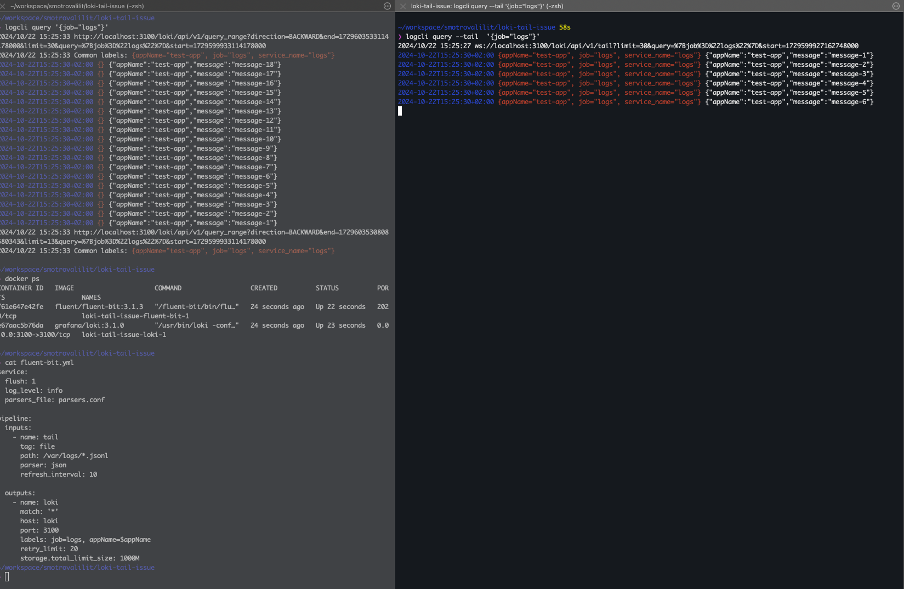
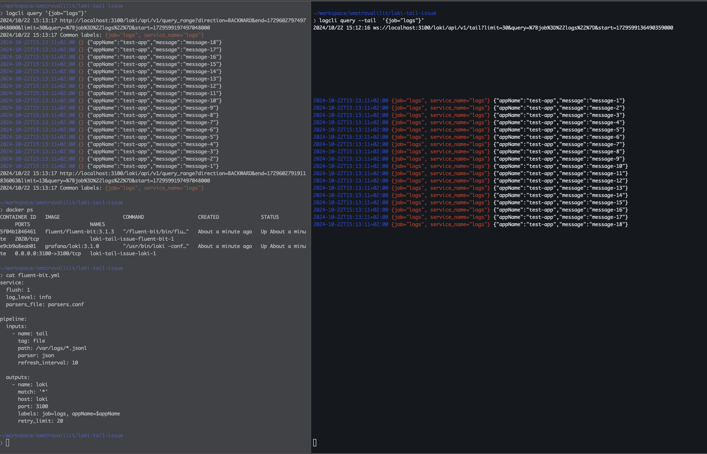
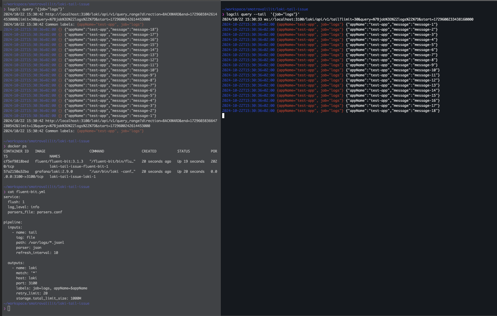

## Issue
 
Loki Tail command does not return all logs that are ingested. Tail looses logs. 

Loki version: 3.1.0

### How to reproduce the issue

1. Install logcli https://grafana.com/docs/loki/latest/query/logcli/
2. Run loki and fluent-bit in docker:
```bash
docker compose up -d 
```
3. Tail logs using logcli:
```bash
logcli query --tail  '{job="logs"}'
```
4 Run bash script to create logs:
```bash
./add_logs.sh
```

### Expected result

All 18 logs that were ingested earlier are displayed in the logcli tail output.

### Actual result

Only the first 6 logs are displayed in the logcli tail output.





### Additional information

When I remove appName=$appName in fluent-bit config for loki output, I see all 18 logs in the logcli tail output.


## Behaviour with Loki version 2.9.0
We see all 18 logs in the logcli tail output.

